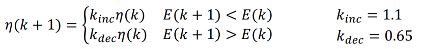

# 电子信息中的机器学习
## work4 彭筵城 2000012826

### 1. 为什么在神经网络建模时，正则化项不考虑偏置b？

- 因为b对结果的作用是提供统一的偏置，正则化是为了防止过拟合，而过拟合时问题并不在于偏置，而在于权重

### 2. 根据题意建立神经网络并完成下列任务：

#### 神经网络建立如下：

```python
import numpy as np
import time
import matplotlib.pyplot as plt


x=np.array([1,3])#输入
y=np.array([0.95,0.05])#输出
w1=np.array([[1,2],[-2,0]])#权重一
w2=np.array([[1,1],[0,-2]])#权重二
a=1#学习率
Gamma=np.array([-3,1])#阈值一
Beta=np.array([2,3])#阈值二
Err=0.0001#均方误差门限
round=0#次数
#参数梯度赋予初值
grad_w1=np.array([[0,0],[0,0]])
grad_Gamma=np.array([0,0])
grad_Beta=np.array([0,0])
grad_w2=np.array([[0,0],[0,0]])

def sigmoid(x):#激活函数
z=np.exp(-1*x)
sig=1/(1+z)
return sig

def err(y0):#误差函数
global y
err=np.dot(y-y0,y-y0)/len(y0)#求均方误差
return err

#第一次处理
a1=np.dot(x,w1)
z1=sigmoid(a1-Gamma)
a2=np.dot(z1,w2)
z2=sigmoid(a2-Beta)
y0=z2
err0=err(y0)
Loss_list[i].append(err0)

#迭代
while err0>=Err and round<10000:#误差阈值门限判断
    '''
    if round%100==0:
        print(round)
        print(err0)
    '''
    round=round+1#计数+1
    #反向梯度传播
    g2=(z2-y)*z2*(1-z2)
    grad_Beta=-g2
    grad_w2=np.outer(z1,g2)
    e1=z1*(1-z1)*np.dot(g2,w2.T)
    grad_Gamma=-e1
    grad_w1=np.outer(x,e1)
    #梯度下降
    Beta=Beta-a*grad_Beta
    w2=w2-a*grad_w2
    Gamma=Gamma-a*grad_Gamma
    w1=w1-a*grad_w1
    #再次计算
    a1=np.dot(x,w1)
    z1=sigmoid(a1-Gamma)
    a2=np.dot(z1,w2)
    z2=sigmoid(a2-Beta)
    y0=z2
    err0=err(y0)
    Loss_list[i].append(err0)

print("W1:",w1)
print("W2:",w2)
print("Gamma:",Gamma)
print("Beta:",Beta)
print("Loss:",err0)
print("Round:",round)
```

#### 1. 修改学习率比较：
- 1，0.5，1.5:

```python
W1: [[ 1.40643036  2.11226362]
 [-0.78070892  0.33679086]]
W2: [[ 1.85641347  1.20016962]
 [ 1.50210833 -1.79476672]]
Gamma: [-3.40643036  0.88773638]
Beta: [0.15914975 2.77387771]
Loss: 9.988627199545404e-05
Round: 391

W1: [[ 1.40852389  2.11251854]
 [-0.77442832  0.33755563]]
W2: [[ 1.87785177  1.20006654]
 [ 1.49496039 -1.79546749]]
Gamma: [-3.40852389  0.88748146]
Beta: [0.17682    2.77470563]
Loss: 9.997685663113416e-05
Round: 779

W1: [[ 1.404397    2.11191275]
 [-0.786809    0.33573825]]
W2: [[ 1.83569965  1.20049333]
 [ 1.50890261 -1.79386044]]
Gamma: [-3.404397    0.88808725]
Beta: [0.14170357 2.77280939]
Loss: 9.939520809348407e-05
Round: 262
```


可以看到学习率较高的一组收敛较快


- 5，30:

```python
W1: [[ 1.39255572  2.10930692]
 [-0.82233284  0.32792077]]
W2: [[ 1.7023985   1.20019582]
 [ 1.546393   -1.7907937 ]]
Gamma: [-3.39255572  0.89069308]
Beta: [0.02675328 2.76885316]
Loss: 9.95548093708807e-05
Round: 80

W1: [[ 1.29872526  1.94443265]
 [-1.10382421 -0.16670205]]
W2: [[ 1.29970381  1.0552842 ]
 [ 2.0272823  -1.94344422]]
Gamma: [-3.29872526  1.05556735]
Beta: [-0.76992793  2.91717981]
Loss: 8.260574367393198e-05
Round: 5
```


此组依然是学习率较高的收敛较快

- 60，150:

```python
W1: [[ 1.57597752  1.60691022]
 [-0.27206745 -1.17926935]]
W2: [[ 0.60377388  0.56629694]
 [ 3.91925286 -2.07435133]]
Gamma: [-3.57597752  1.39308978]
Beta: [-2.55164071  3.4139367 ]
Loss: 9.653573116926207e-05
Round: 132

W1: [[ 2.48574526  1.94596028]
 [ 2.45723579 -0.16211916]]
W2: [[ 2.67833997  1.06900543]
 [10.29341227 -1.90768033]]
Gamma: [-4.48574526  1.05403972]
Beta: [-12.08013617   2.86879068]
Loss: 0.0012499999595314655
Round: 10000#此例不能收敛
```


此组发现学习率过高，高的一组已无法收敛，较低的一组迭代次数也比之前高

#### 2. 修改误差门限比较：

- 0.0001，0.001：

```python
W1: [[ 1.40643036  2.11226362]
 [-0.78070892  0.33679086]]
W2: [[ 1.85641347  1.20016962]
 [ 1.50210833 -1.79476672]]
Gamma: [-3.40643036  0.88773638]
Beta: [0.15914975 2.77387771]
Loss: 9.988627199545404e-05
Round: 391

W1: [[ 1.361369    2.12244532]
 [-0.91589301  0.36733597]]
W2: [[ 1.70463848  1.02502119]
 [ 1.34760642 -1.9705615 ]]
Gamma: [-3.361369    0.87755468]
Beta: [0.32814114 2.96661178]
Loss: 0.0009875788812201388
Round: 59
```


观察易知门限越宽越容易达到收敛

#### 3. 修改初始权重值：

- a) 
```python
    w1=np.array([[1,2],[-2,0]])
    w2=np.array([[1,1],[0,-2]])
```
- b)
```python
    w1=np.array([[1,2],[-1.5,1]])
    w2=np.array([[0.7,0.7],[-1,-3]])
```

```python
W1: [[ 1.40643036  2.11226362]
 [-0.78070892  0.33679086]]
W2: [[ 1.85641347  1.20016962]
 [ 1.50210833 -1.79476672]]
Gamma: [-3.40643036  0.88773638]
Beta: [0.15914975 2.77387771]
Loss: 9.988627199545404e-05
Round: 391

W1: [[ 1.34840498  1.95713281]
 [-0.45478506  0.87139843]]
W2: [[ 2.17526888  1.34907734]
 [ 0.91693177 -2.33818268]]
Gamma: [-3.34840498  1.04286719]
Beta: [0.04500321 2.32257426]
Loss: 9.992641678634006e-05
Round: 1626
```


可以发现初始权重的选择对收敛速度的影响很大

#### 4. 修改初始阈值设定：

- a) 
```python
    Gamma=np.array([-3,1])
    Beta=np.array([2,3])
```
  b)
```python
    Gamma=np.array([-2,0])
    Beta=np.array([1,4])
```

```python
W1: [[ 1.40643036  2.11226362]
 [-0.78070892  0.33679086]]
W2: [[ 1.85641347  1.20016962]
 [ 1.50210833 -1.79476672]]
Gamma: [-3.40643036  0.88773638]
Beta: [0.15914975 2.77387771]
Loss: 9.988627199545404e-05
Round: 391

W1: [[ 1.3630085   2.00353884]
 [-0.91097451  0.01061653]]
W2: [[ 1.12272548  1.39540394]
 [ 1.60178539 -1.2524012 ]]
Gamma: [-2.3630085  -0.00353884]
Beta: [-0.75564339  3.19596131]
Loss: 9.964911544122988e-05
Round: 2365
```


观察得知初始阈值的选择对收敛速度的影响也很大

#### 5. 修改学习率更新方法：


```python
#学习率修正
temp_err=err(y0)
if temp_err<err0:
    a=1.1*a
elif temp_err>err0:
    a=0.65*a
```

```python
W1: [[ 1.40648378  2.1117827 ]
 [-0.78054865  0.3353481 ]]
W2: [[ 1.83594449  1.20605759]
 [ 1.51194428 -1.78839524]]
Gamma: [-3.40648378  0.8882173 ]
Beta: [0.13921561 2.76705521]
Loss: 9.017033475491992e-05
Round: 39
```


对比初始学习率不变的策略，此策略收敛速度明显提高